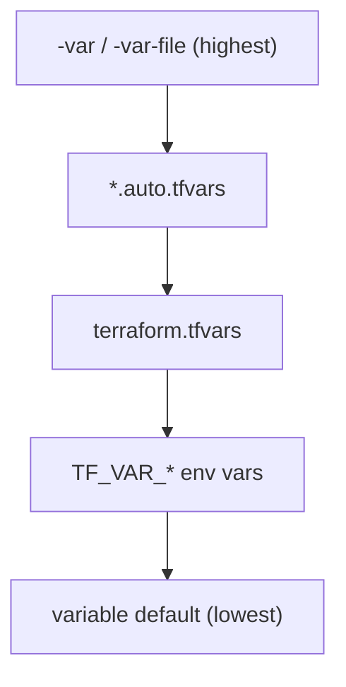

## Provider Block

This block is used to extend Terraform's functionality. It allows Terraform to connect to any API-driven platform — mainly cloud platforms, SaaS applications, or on-premises hardware solutions. A provider defines where and what Terraform can manage, such as AWS for cloud resources or GitHub for repositories.

A provider is a plugin that extends the functionality of Terraform Core and enables it to interact with external APIs.

- Resources are implemented by a provider. Without them, Terraform would not be able to provision or manage any infrastructure.
- Providers are maintained by HashiCorp, partners, and the Terraform community.
- Providers are developed separately from Terraform Core, so functionality can be added or changed per version.

Example of a provider configuration block:

```hcl
provider "aws" {
  region  = "us-east-1"
  profile = "example-profile"
}
```

Some providers require authentication arguments, but it is better to define credentials via environment variables or shared credentials files to avoid security leaks. A single provider block enables Terraform to manage multiple resources on a platform.

While providers are stored on GitHub, full documentation can be found on the [Terraform Registry](https://registry.terraform.io/).

When declared, the provider is downloaded during `terraform init` and cached in `.terraform/providers/`.

## Required Providers Block

Declare which providers the configuration needs inside the top-level `terraform` block. This is separate from the provider _configuration_ block.

```hcl
terraform {
  required_providers {
    aws = {
      source  = "hashicorp/aws"
      version = "~> 5.0"
    }
  }
}
```

| Concept | Block | Purpose |
|---|---|---|
| Provider requirement | `terraform { required_providers {} }` | Declares provider source and version constraints |
| Provider configuration | `provider "aws" {}` | Sets region, credentials, default tags, etc. |

> **Exam tip:** `required_providers` goes in the `terraform` block. `provider "aws"` is a separate block. Confusing these two is a common exam trap.

### Version Constraint Operators

```hcl
version = "5.31.0"       # exact version
version = ">= 5.0"       # minimum version
version = "~> 5.0"       # >= 5.0, < 6.0 ( pessimistic constraint — most common )
version = ">= 4.0, < 6.0" # compound constraint
```

> **Real-world:** Pin major versions with `~>` in `required_providers`. Let `.terraform.lock.hcl` pin exact patch versions for reproducibility across teammates and CI.

## Multiple Provider Instances (Aliases)

Use `alias` when you need two configurations of the same provider — for example, multi-region AWS or multi-account setups.

```hcl
provider "aws" {
  region = "us-east-1"
}

provider "aws" {
  alias  = "west"
  region = "us-west-2"
}

resource "aws_s3_bucket" "east" {
  bucket = "logs-east"
}

resource "aws_s3_bucket" "west" {
  provider = aws.west
  bucket   = "logs-west"
}
```

> **Exam tip:** The default provider has no alias. Use the `provider` meta-argument with an alias reference (e.g., `provider = aws.west`). Omit it to use the default provider configuration.

## Authentication Best Practices

Avoid hardcoding credentials in provider blocks. Preferred methods for AWS:

| Method | Example | When to Use |
|---|---|---|
| Environment variables | `AWS_ACCESS_KEY_ID`, `AWS_SECRET_ACCESS_KEY`, `AWS_SESSION_TOKEN` | CI/CD, temporary credentials |
| Shared credentials file | `~/.aws/credentials` + `profile` argument | Local development |
| IAM role | EC2 instance profile, ECS task role | Workloads running on AWS |
| OIDC / IAM Identity Center | GitHub Actions → AWS via OIDC | Modern CI/CD without long-lived keys |

```hcl
provider "aws" {
  region  = var.aws_region
  profile = var.aws_profile   # optional — uses default profile if omitted
}
```

> **Common mistake:** Committing `access_key` and `secret_key` in a provider block. This fails security reviews and Terraform Associate exam scenarios.

> **AWS SAA-C03 tie-in:** Prefer IAM roles over access keys. Use least-privilege IAM policies scoped to the Terraform automation role. Separate roles per environment (dev/staging/prod).

## Provider Meta-Argument

Resources inherit the default provider unless you specify otherwise:

```hcl
resource "aws_instance" "example" {
  provider = aws.west
  # ...
}
```

## Implicit vs. Explicit Provider Dependencies

- Provider configuration is evaluated before resources.
- If a resource depends on another resource in a different region/account, use the correct `provider` meta-argument — not `depends_on` on the provider.

## The Terraform Registry

- **Providers** — `registry.terraform.io/providers/hashicorp/aws`
- **Modules** — reusable configurations published by HashiCorp and the community
- **Policy Libraries** — Sentinel policies (Terraform Enterprise / HCP Terraform)

During `init`, Terraform downloads providers from the registry (or a configured mirror) based on `required_providers` source addresses.

## Common Mistakes

- Declaring `provider "aws"` but forgetting `required_providers` — works in older configs but fails provider source validation in Terraform 0.13+.
- Using the wrong provider alias and wondering why resources land in the wrong region.
- Running `init -upgrade` in CI without reviewing provider changelogs — can introduce breaking changes.
- Assuming `validate` downloads or verifies providers — only `init` does.

## Provider Configuration in Modules

Child modules do **not** automatically inherit `provider` blocks from the root module. The root module configures providers; child modules **receive** them through implicit inheritance (default provider) or explicit `providers` mapping on the `module` block.

### Default Inheritance

If a child module uses `provider "aws"` without an alias, it inherits the root module's default AWS provider configuration automatically. No extra mapping is required.

```hcl
# Root module — providers.tf
provider "aws" {
  region = "us-east-1"
}

# Root module — main.tf
module "network" {
  source = "./modules/network"
  # child module uses root's default aws provider
}
```

### Explicit Provider Mapping

When a module uses **aliased** providers, the root module must pass them in using the `providers` meta-argument:

```hcl
# Child module — expects aliased provider (see configuration_aliases below)
resource "aws_s3_bucket" "replica" {
  provider = aws.replica
  bucket   = var.bucket_name
}

# Root module — pass aliased provider into module
module "replication" {
  source = "./modules/replication"

  providers = {
    aws.replica = aws.west   # map module's aws.replica to root's aws.west
  }

  bucket_name = "logs-west"
}
```

> **Exam tip:** The `providers` map keys use the **module's** provider configuration names (including alias). Values reference **root module** provider configurations.

> **Common mistake:** Defining `provider "aws"` blocks inside a reusable module without declaring `configuration_aliases`. Terraform will reject passing aliased providers from the root.

## `configuration_aliases` (Module Authors)

Reusable modules that need non-default providers must declare which provider aliases they accept inside a `terraform` block:

```hcl
# modules/replication/versions.tf
terraform {
  required_providers {
    aws = {
      source                = "hashicorp/aws"
      version               = "~> 5.0"
      configuration_aliases = [aws.replica]
    }
  }
}
```

- Tells Terraform the module can accept an `aws` provider with alias `replica`.
- The module itself does **not** configure credentials or region — the root module does that and passes the configured provider in.
- Keeps modules portable: the same module can target different accounts or regions depending on how the caller maps providers.

> **Real-world:** Module authors should never hardcode `region` or credentials. Accept providers from the caller and document required `providers` mappings in the module README.

## AWS Default Tags (`default_tags`)

Apply tags to all AWS resources managed by a provider without repeating `tags` on every resource block:

```hcl
provider "aws" {
  region = "us-east-1"

  default_tags {
    tags = {
      Environment = var.environment
      ManagedBy   = "Terraform"
      Project     = var.project_name
    }
  }
}
```

- Tags set here are merged with resource-level `tags`. Resource-level tags override `default_tags` on key collision.
- Applies only to resources created through that provider configuration — useful for multi-account setups with separate provider blocks.
- Reduces tag drift and satisfies organizational tagging policies (cost allocation, ownership, compliance).

> **AWS SAA-C03 tie-in:** Consistent tagging supports Cost Explorer, Resource Groups, and SCP enforcement. Centralizing tags in the provider block is cleaner than tagging every resource individually.

> **Exam tip:** `default_tags` is a provider-level setting, not a resource meta-argument. It does not replace resource-specific tags you need for unique identification (e.g., `Name` per instance).

## Private Provider Registries

Organizations using **Terraform Enterprise** or **HCP Terraform** can host private providers instead of relying on the public Terraform Registry.

| Feature | Public Registry | Private Registry |
|---|---|---|
| Access | Open to all | Restricted to organization |
| Use case | Community and HashiCorp providers | Internal providers, air-gapped environments |
| Source address | `hashicorp/aws` | `<hostname>/<namespace>/<name>` |

Example with a private registry:

```hcl
terraform {
  required_providers {
    mycloud = {
      source  = "app.terraform.io/my-org/mycloud"
      version = "~> 1.0"
    }
  }
}
```

- `terraform login` authenticates to HCP Terraform / Terraform Enterprise and enables downloading private providers during `init`.
- Private registries also host **private modules** and **policy libraries** (Sentinel) on enterprise tiers.
- Provider mirrors can cache public providers internally for security and compliance without publishing custom providers.

> **Real-world:** Regulated industries use private registries to vet provider binaries before they reach production CI pipelines. Pair with network egress controls and signed provider verification.

> **Exam tip:** Know that `required_providers` `source` uses the format `hostname/namespace/type` — not just `hashicorp/aws`. Terraform 0.13+ requires an explicit source for all providers.

## `resource` Block

The `resource` block is the core element in Terraform. It declares infrastructure that Terraform should **create, update, and destroy** to match the desired configuration.

Syntax:

```hcl
resource "<TYPE>" "<NAME>" {
  # arguments and nested blocks
}
```

- **Type** — Identifies what to manage (e.g., `aws_dynamodb_table`). Defined by the provider and documented in the Terraform Registry.
- **Name** — A local label you choose. Used to reference the resource elsewhere in the configuration. Must be unique per resource type within a module.
- **Arguments** — Configure the resource (e.g., `billing_mode`, `runtime`). Required vs. optional arguments depend on the resource type.
- **Nested blocks** — Structured sub-configuration (e.g., `attribute {}`, `environment {}`).

> **Exam tip:** Address a resource as `<TYPE>.<NAME>.<ATTRIBUTE>` — for example, `aws_iam_role.lambda_iam_role.arn`. This differs from `data` sources (`data.aws_ami.example.id`) and `module` outputs (`module.vpc.vpc_id`).

### Resource vs. `data` Source

| Block | Purpose | Lifecycle |
|---|---|---|
| `resource` | Manage infrastructure Terraform creates and owns | Create, read, update, delete |
| `data` | Read existing infrastructure or computed values | Read only — never created or destroyed by Terraform |

Use `resource` when Terraform should manage the object. Use `data` when you need information about something that already exists or is computed outside Terraform (e.g., latest AMI, current AWS account ID).

> **Common mistake:** Using a `resource` block for objects you did not create and do not want Terraform to destroy (e.g., a shared VPC managed by another team). Use a `data` source instead.

### Meta-Arguments

Meta-arguments apply to any resource block, regardless of provider:

| Meta-argument | Purpose |
|---|---|
| `provider` | Select a non-default or aliased provider (see [[#Multiple Provider Instances (Aliases)]]) |
| `depends_on` | Declare explicit dependency when references alone are not enough |
| `count` | Create multiple similar resources from one block |
| `for_each` | Create multiple resources from a map or set |
| `lifecycle` | Control create/destroy behavior (`create_before_destroy`, `prevent_destroy`, `ignore_changes`) |

> **Exam tip:** `count` and `for_each` are mutually exclusive on the same block. Prefer `for_each` for most production use cases — resource addresses use map keys instead of numeric indexes.

### Example of a Resource

```hcl
resource "aws_dynamodb_table" "basic_dynamodb_table" {
  name         = local.dynamodb_table_name
  billing_mode = "PAY_PER_REQUEST"
  hash_key     = "id"

  attribute {
    name = "id"
    type = "S"
  }

  ttl {
    attribute_name = "ttl"
    enabled        = true
  }

  tags = local.common_tags
}
```

- Top-level keys (`name`, `billing_mode`) are **arguments**.
- `attribute {}` and `ttl {}` are **nested blocks** — common on AWS resources.
- After `terraform apply`, Terraform stores resource attributes in **state** and tracks them on future plans.

### Resource Referencing

Resource referencing connects blocks by passing values from one resource to another. When one resource references another's attributes, Terraform creates an **implicit dependency** and orders operations correctly.

Reference syntax: `<TYPE>.<NAME>.<ATTRIBUTE>`

```hcl
resource "aws_lambda_function" "basic_lambda_function" {
  filename      = data.archive_file.basic_lambda.output_path
  function_name = local.lambda_function_name
  description   = "Basic lambda function deployed with Terraform"
  role          = aws_iam_role.lambda_iam_role.arn   # implicit dependency on IAM role
  handler       = "lambda_function.lambda_handler"
  code_sha256   = data.archive_file.basic_lambda.output_base64sha256

  runtime = "python3.12"
  timeout = 10

  environment {
    variables = {
      DYNAMODB_TABLE_NAME = aws_dynamodb_table.basic_dynamodb_table.name
      ENVIRONMENT         = var.environment
      LOG_LEVEL           = "info"
    }
  }

  tags = local.common_tags
}
```

This example shows three reference types in one block:

- **Resource** — `aws_iam_role.lambda_iam_role.arn` (managed by Terraform)
- **Data source** — `data.archive_file.basic_lambda.output_path` (read-only)
- **Variable** — `var.environment` (input from outside the resource)

> **Real-world:** Chaining references (Lambda → IAM role → DynamoDB table name) is how Terraform builds a dependency graph. Avoid hardcoded ARNs or table names — they break portability across environments.

> **Common mistake:** Referencing a resource before it exists in configuration, or using the wrong attribute name from the provider docs. Run `terraform plan` to catch missing or invalid references early.

> **Exam tip:** Removing a `resource` block from configuration and running `terraform apply` schedules that resource for **destroy**. Terraform does not delete resources that are only removed from references but still declared in code.

See also: [[01_Fundamentals#Resource Referencing]] and [[02_Terraform_Workflow#Dependencies]].

## `data` Block

The `data` block reads information Terraform needs at plan/apply time **without managing lifecycle** of that object. Terraform never creates, updates, or destroys data sources.

Two common use cases:

| Use case | Example | What it reads |
|---|---|---|
| **Existing infrastructure** | `data "aws_vpc" "shared"` | A VPC already created outside this configuration |
| **Computed / filtered values** | `data "aws_iam_policy_document" "lambda_assume_role"` | A policy document built from HCL — not an existing AWS object |
| **Provider defaults** | `data "aws_availability_zones" "available"` | Current account/region metadata |

- Retrieve details of existing or computed values to reference in other blocks.
- Resolve dependencies when one block needs properties from another source.
- Avoid hardcoded values by pulling data dynamically at plan time.

> **Exam tip:** `data` sources are **read-only**. Removing a `data` block does **not** destroy anything in the cloud. Contrast with `resource` blocks (see [[#`resource` Block]]).

### Referencing a `data` Block

Reference syntax: `data.<TYPE>.<NAME>.<ATTRIBUTE>`

```hcl
data.aws_iam_policy_document.lambda_assume_role.json
aws_vpc.shared.id
var.environment
```

### Usage Example

```hcl
data "aws_iam_policy_document" "lambda_assume_role" {
  statement {
    effect  = "Allow"
    actions = ["sts:AssumeRole"]

    principals {
      type        = "Service"
      identifiers = ["lambda.amazonaws.com"]
    }
  }
}

resource "aws_iam_role" "lambda_iam_role" {
  name_prefix        = "${local.name_prefix}-lambda-role-"
  assume_role_policy = data.aws_iam_policy_document.lambda_assume_role.json

  lifecycle {
    create_before_destroy = true
  }
}
```

- `aws_iam_policy_document` generates JSON — it does not read an existing IAM policy from AWS.
- The role references `.json` from the data source, creating an implicit dependency.

> **Common mistake:** Treating every `data` block as "existing infrastructure." Policy documents, AMI filters, and caller identity are computed at plan time, not fetched as managed resources.

> **Real-world:** Use `data` sources for shared networking (VPC, subnets) owned by a platform team. Use `resource` blocks only for infrastructure your Terraform workspace owns.

See also: [[01_Fundamentals#Resource Referencing]] — `data` references follow the same dependency rules as resources.

## `variable` Block

The `variable` block defines **inputs** to a module or root configuration. It avoids hardcoding values and makes configurations reusable across environments (dev, staging, prod).

- **Dynamic inputs** — Pass different values per environment or scenario.
- **Centralized values** — Change once, apply everywhere the variable is referenced.
- **Reusability** — Share the same module or pattern across projects and teams.

### Usage Example

```hcl
variable "application_name" {
  description = "Project or application name. Used as a prefix for resource naming."
  type        = string
  default     = "terraform-workflow"

  validation {
    condition     = length(var.application_name) >= 3 && length(var.application_name) <= 20
    error_message = "Application name must be between 3 and 20 characters."
  }
}

variable "environment" {
  description = "Deployment environment (dev, staging, prod). Used as a suffix for resources."
  type        = string
  default     = "dev"

  validation {
    condition     = contains(["dev", "staging", "prod"], var.environment)
    error_message = "Invalid environment. Must be one of: dev, staging, prod."
  }
}
```

Reference a variable anywhere in the configuration: `var.environment`

> **Exam tip:** `validation` blocks run at plan time. The `condition` must evaluate to `true` or Terraform fails before apply.

### Variable Types

**Primitive types** (most common on the exam):

| Type | Example value |
|---|---|
| `string` | `"prod"` |
| `number` | `3` |
| `bool` | `true` |

**Complex types**:

| Type | Description | Example |
|---|---|---|
| `list(<TYPE>)` | Ordered sequence; index starts at `0` | `["us-east-1a", "us-east-1b"]` |
| `map(<TYPE>)` | Key-value pairs | `{ dev = "t3.micro", prod = "t3.large" }` |
| `set(<TYPE>)` | Unordered collection of unique values; not indexable | `toset(["a", "b"])` |
| `object({...})` | Structured shape with named attributes | `object({ name = string, port = number })` |
| `tuple([...])` | Fixed-length sequence with typed positions | `tuple([string, number])` |

> **Common mistake:** Indexing a `set` directly (e.g., `my_set[0]`). Convert with `tolist()` first, or use a `list` if order matters.

### Assigning Values to Variables

| Method | Example | Notes |
|---|---|---|
| **Default in `variable` block** | `default = "dev"` | Lowest precedence |
| **Environment variable** | `TF_VAR_environment=prod` | Must prefix with `TF_VAR_` |
| **`.tfvars` file** | `environment = "prod"` in `terraform.tfvars` | Auto-loaded from working directory |
| **Command line** | `terraform plan -var="environment=prod"` | Highest precedence |

Use `-var-file="prod.tfvars"` to load a specific file. Exclude environment-specific `.tfvars` from version control when they contain sensitive values.

### Order of Precedence

When multiple sources define the same variable, **the first item in this list wins** (highest precedence):

1. **Command-line flags** — `-var` and `-var-file`
2. **`*.auto.tfvars`** — loaded automatically, lexical filename order
3. **`terraform.tfvars`** / `terraform.tfvars.json`
4. **Environment variables** — `TF_VAR_<name>`
5. **`default` in the `variable` block** — used only when nothing else supplies a value



> **Exam tip:** `-var` on the command line **always wins** over `terraform.tfvars` and `TF_VAR_*`. Defaults never override an explicitly set value.

> **Real-world:** Store non-sensitive defaults in `terraform.tfvars.example` (committed). Keep real `terraform.tfvars` and secrets in `.gitignore`.

Optional arguments worth knowing:

- `sensitive = true` — hides value in CLI output (still stored in state).
- `nullable = false` — variable must receive an explicit value (Terraform 1.1+).

## `output` Block

The `output` block exposes values **after apply** — IP addresses, ARNs, endpoints, or any attribute others need without opening the provider console.

- Display key infrastructure details in the CLI after deployment.
- Pass data from child modules to the root module (or to other modules via root outputs).
- Feed CI/CD pipelines and automation via `terraform output -json`.

Reference from the CLI: `terraform output <NAME>` or `terraform output -json`.

### Usage Example

```hcl
output "lambda_metadata" {
  description = "Lambda function metadata"
  value = {
    name = aws_lambda_function.basic_lambda_function.function_name
    arn  = aws_lambda_function.basic_lambda_function.arn
  }
}

output "dynamodb_table" {
  description = "DynamoDB table metadata"
  value = {
    name = aws_dynamodb_table.basic_dynamodb_table.name
    arn  = aws_dynamodb_table.basic_dynamodb_table.arn
  }
}
```

### Sensitive Outputs

Mark outputs that contain secrets so Terraform redacts them in the CLI:

```hcl
output "database_endpoint" {
  description = "Database connection endpoint"
  value       = aws_db_instance.main.endpoint
  sensitive   = true
}
```

> **Exam tip:** `sensitive = true` on an `output` hides the value in normal CLI output. It does **not** remove the value from state — treat state as sensitive.

### Real-World Scenarios

1. Outputs print in the CLI after a successful `terraform apply`.
2. Values are stored in **state** and retrieved with `terraform output` or `terraform output -json`.
3. Root module **outputs** are public to module consumers. Child module outputs are passed to the root via the `module` block: `module.network.vpc_id`.
4. Use `sensitive = true` for credentials, tokens, or private endpoints.

> **Common mistake:** Expecting outputs during `terraform plan`. Outputs are evaluated at apply time and stored in state after a successful apply.

## `terraform` Block
The top-level `terraform` block sets **project-wide settings**: Terraform Core version, required providers, and backend configuration for remote state.

- **Version control** — Enforce compatible Terraform and provider versions across teams.
- **State storage** — Configure where state is persisted (local by default, remote for teams).
- **Consistency** — Prevent "works on my machine" drift from version mismatches.

> **Exam tip:** The `terraform` block is meta-configuration. It does not create infrastructure — it configures how Terraform runs. Provider _requirements_ go here; provider _settings_ (region, credentials) go in `provider` blocks (see [[#Required Providers Block]]).

### Usage Example

```hcl
terraform {
  required_version = ">= 1.5.0, < 2.0.0"

  required_providers {
    aws = {
      source  = "hashicorp/aws"
      version = "~> 5.0"
    }
    archive = {
      source  = "hashicorp/archive"
      version = "~> 2.4"
    }
  }

  backend "s3" {
    bucket         = "my-terraform-state"
    key            = "prod/terraform.tfstate"
    region         = "us-east-1"
    dynamodb_table = "terraform-locks"
    encrypt        = true
  }
}
```

| Setting | Purpose |
|---|---|
| `required_version` | Terraform CLI version constraint |
| `required_providers` | Provider source + version constraints |
| `backend` | Remote state location and locking |

### Version Constraints

Same operators apply to `required_version` and provider versions:

```hcl
required_version = "1.9.8"         # exact version only
required_version = ">= 1.9.8"      # minimum version
required_version = "~> 1.9.8"      # >= 1.9.8, < 1.10.0
required_version = ">= 1.5, < 2.0" # compound constraint
```

> **Common mistake:** Confusing `required_version` (Terraform **Core** binary) with `required_providers` version (provider **plugins**). They are independent constraints.

> **AWS SAA-C03 tie-in:** S3 backend + DynamoDB table for locking is the standard AWS pattern for team state management. Enable `encrypt = true` on the backend block.

See also: [[03_Terraform_File_Structure#Common Terraform Files]] — where to place the `terraform` block (`versions.tf` or `terraform.tf`).

## Configuration Blocks Summary

| Block | Purpose | Reference syntax |
|---|---|---|
| `terraform` | Version, providers, backend | N/A (meta-configuration) |
| `provider` | Platform connection settings | `provider = aws.west` (meta-argument) |
| `variable` | Input values | `var.<name>` |
| `output` | Exposed values after apply | `terraform output <name>` |
| `resource` | Managed infrastructure | `<type>.<name>.<attr>` |
| `data` | Read-only lookups | `data.<type>.<name>.<attr>` |

## Related Notes

- [[01_Fundamentals]] — HCL basics and core components
- [[02_Terraform_Workflow#The `terraform init` command]] — when providers are downloaded and configuration is applied
- [[03_Terraform_File_Structure]] — file organization, state files, and where to place blocks
- [[00_Index]] — study progress